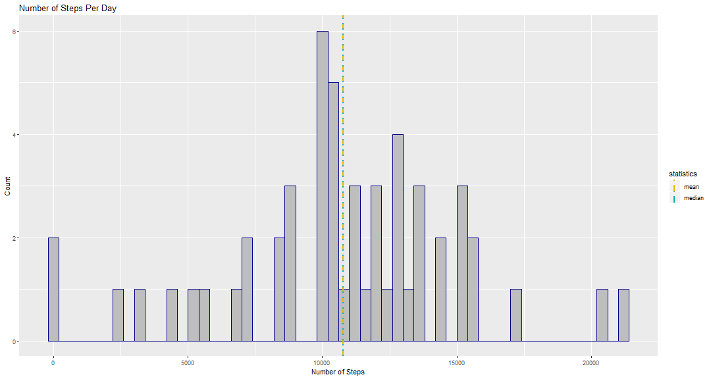
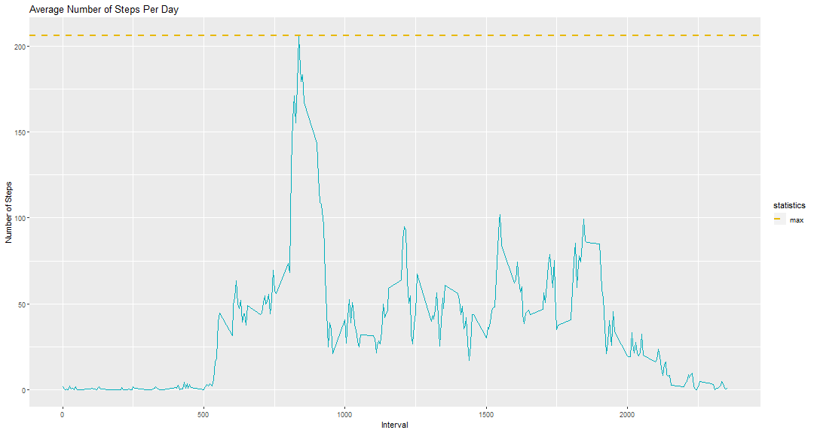
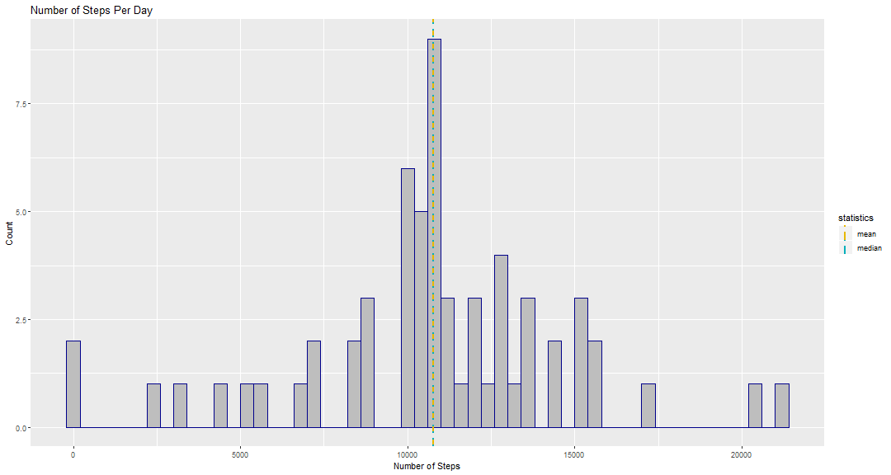
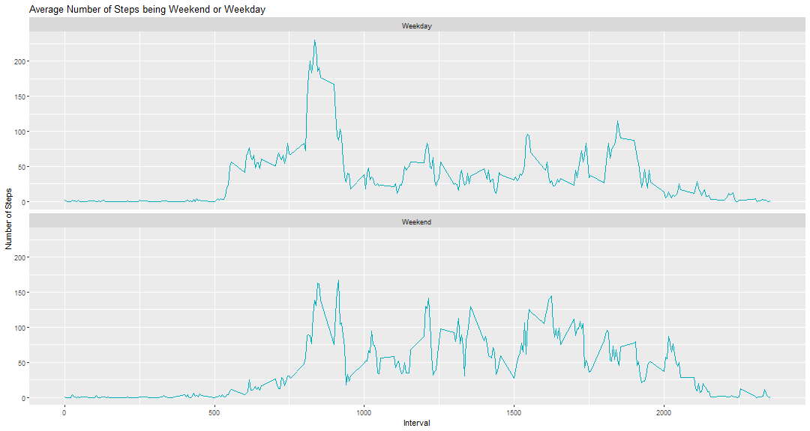

```r
activity <- read.delim("activity.csv", header=TRUE, sep=",", stringsAsFactors=FALSE, dec=".")

activity$date<-as.Date(activity$date, "%Y-%m-%d")

activityClean<-activity[!is.na(activity$steps),]
```

## What is mean total number of steps taken per day?

1.Number of steps taken per day.


```r
library(ggplot2)
library(dplyr)
# Sum for each month
stepsPerDay <- activityClean
stepsPerDay <-
stepsPerDay %>% group_by(date) %>% summarise(sum_steps = sum(steps, na.rm =
TRUE))

#Finding the mean and median
mean<-round(mean(stepsPerDay$sum_steps),0)
median<-round(median(stepsPerDay$sum_steps),0)

# Plotting the steps per day

p1 <- ggplot(stepsPerDay, aes(x = sum_steps)) + labs(title = "Number of Steps Per Day") +
labs(x = "Number of Steps", y = "Count")  +   geom_histogram(binwidth = 400, col = "darkblue",fill = "gray") +
geom_vline(aes(xintercept = mean(stepsPerDay$sum_steps),color = "mean"),linetype = "dashed",size = 1) +
geom_vline(aes(xintercept = median(stepsPerDay$sum_steps),color = "median"),linetype = "dotted",size = 1)+
scale_color_manual(name = "statistics",values = c(median = "#00AFBB", mean = "#E7B800"))

p1
```


The mean steps per day are 10766 and the median steps per day are 10765.

## What is the average daily activity pattern?

1.Average of number of steps taken per interval.


```r
library(ggplot2)
library(dplyr)
# Mean for each month
meanStepsPerDay <- activityClean
meanStepsPerDay <-
meanStepsPerDay %>% group_by(interval) %>% summarise(mean_steps = mean(steps, na.rm =
TRUE))

# Max Steps
maxSteps<-max(meanStepsPerDay$mean_steps, na.rm=TRUE)
meanInterval<-meanStepsPerDay[meanStepsPerDay$mean_steps==maxSteps,1]

# Plotting the average steps per day

p2 <- ggplot(meanStepsPerDay, aes(x = interval, y=mean_steps)) +
geom_line(na.rm=TRUE,color="#00AFBB") + labs(title = "Average Number of Steps Per Day") + labs(x = "Interval", y = "Number of Steps") + geom_hline(aes(yintercept = max(meanStepsPerDay$mean_steps, na.rm=TRUE),color = "max"),linetype = "dashed", size = 1) + scale_color_manual(name = "statistics",values = c(max = "#E7B800"))

p2
```



The 5-minute interval, on average across all the days in the dataset, that contains the maximum number of steps is 835.

##Imputing missing values

1.What are the total number of rows with missing values in the dataset?


```r
library(ggplot2)
library(dplyr)
# Number of rows with missing values
rowNA<-sum(apply(is.na(activity), 1, sum))
```
The total number of rows with NAs is 2304.

2.Filling in all of the missing values in the dataset


```r
library(ggplot2)
library(dplyr)
# Mean for each month
meanStepsPerDay <- activityClean
meanStepsPerDay <-
meanStepsPerDay %>% group_by(interval) %>% summarise(mean_steps = mean(steps, na.rm =
TRUE))

#Assign the number of steps of the mean for that interval.
newAct<-activity
newActAvg<-merge(x=newAct,y=meanStepsPerDay, by="interval", all.x=TRUE)

newActAvg$steps <- ifelse(is.na(newActAvg$steps), round(newActAvg$mean_steps,1), round(newActAvg$steps,1))

#Drop the mean_steps column
newActAvg$mean_steps<-NULL
```
3.Histogram of the total number of steps taken each day.


```r
library(ggplot2)
library(dplyr)
# Sum for each month
newActAvgSum <-
newActAvg %>% group_by(date) %>% summarise(sum_steps = sum(steps, na.rm =
TRUE))

#Finding the mean and median
meanNA<-round(mean(newActAvgSum$sum_steps),0)
medianNA<-round(median(newActAvgSum$sum_steps),0)

# Plotting the steps per day

p1 <- ggplot(newActAvgSum, aes(x = sum_steps)) + labs(title = "Number of Steps Per Day") +
labs(x = "Number of Steps", y = "Count")  +   geom_histogram(binwidth = 400, col = "darkblue",fill = "gray") +
geom_vline(aes(xintercept = mean(stepsPerDay$sum_steps),color = "mean"),linetype = "dashed",size = 1) +
geom_vline(aes(xintercept = median(stepsPerDay$sum_steps),color = "median"),linetype = "dotted",size = 1)+
scale_color_manual(name = "statistics",values = c(median = "#00AFBB", mean = "#E7B800"))

p1
```



The mean steps per day are 10766 and the median steps per day are 10766. The difference is barely noticeable with the original calculation.

4.Are there differences in activity patterns between weekdays and weekends?


```r
library(ggplot2)
library(dplyr)

# Calculating if days are weekdays or not
newActAvg$weekday<-NA
newActAvg$weekday<-ifelse(weekdays(newActAvg$date) == "Saturday" | weekdays(newActAvg$date) == "Sunday" ,"Weekend","Weekday")


# Mean for each month
meanStepsWeekday <- newActAvg
meanStepsWeekday <-
meanStepsWeekday %>% group_by(interval,weekday) %>% summarise(mean_steps = mean(steps, na.rm =
TRUE))


# Plotting the average steps per day

p2 <- ggplot(meanStepsWeekday, aes(x = interval, y=mean_steps)) +
geom_line(color="#00AFBB") + facet_wrap(~weekday, ncol = 1, nrow=2)  + labs(title = "Average Number of Steps being Weekend or Weekday") + labs(x = "Interval", y = "Number of Steps") 

p2
```



The mean steps per day are 10766 and the median steps per day are 10766. The difference is barely noticeable with the original calculation.


```r
#library("knitr")
#knit("PA1_template.Rmd")
```

